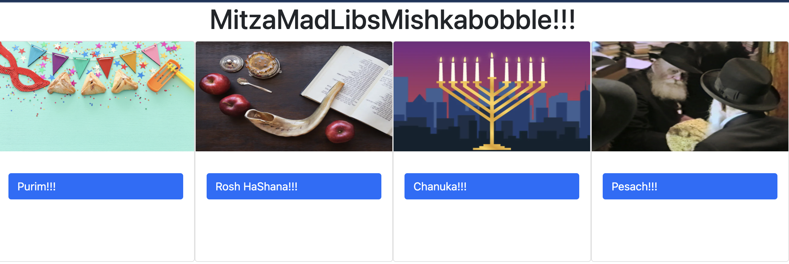

# Mitzvah Mad Libs Mishkababbkle (MMM)

I built MMM because I remember how fun Madlibs were as a child. I made it suitable for Jewish children because I've noticed a lack of Jewish educational apps. 
---
Getting started 
Submit what the form asks for, click MitzvaMishkababbleButton, choose a story and watch the magic unfold before your eyes.

[check it out](http://www.mitzvamadlibs.surge.sh)

    

Technologies used : JavaScript, HTML, CSS

Planned Future Enhancements
1. Improve the graphics (audio, more color, etc.). 
2. Ask the user to input different kinds of information (age, cities, numbers, adverbs, etc.)
3. Expand Mitzva List
4. Add animation to Mitzva Mishkababble button. 

---
Credits

Chabad.org - http://01.myjewishpage.com/images/mychabad/communicator/ChanukahTownHall/menorahMobileSlice.jpg
Static = https://static.independent.co.uk/s3fs-public/thumbnails/image/2019/09/28/12/rosh-hashanah-main-0.jpg?quality=75&width=990&auto=webp&crop=982:726,smart
     http://01.myjewishpage.com/images/mychabad/communicator/ChanukahTownHall/menorahMobileSlice.jpg"

